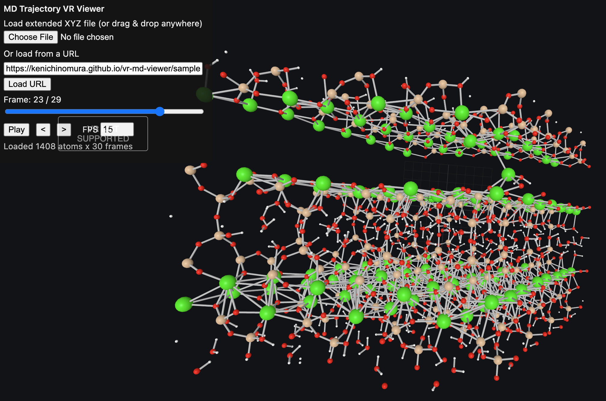

# VR MD Viewer

A browser-based molecular dynamics trajectory viewer for extended XYZ files, with desktop controls and WebXR support for virtual reality headsets.

[Open the viewer](https://kenichinomura.github.io/vr-md-viewer/)



## Features

- Load extended XYZ trajectories from a local file, drag-and-drop, or URL.
- Play multi-frame trajectories with a frame slider, step buttons, and FPS control.
- Color atoms by element and update atom types correctly on each frame.
- Compute bonds per frame from covalent radii.
- Enter VR through WebXR when the browser and headset support it.
- Grab, move, and scale the molecule with VR controllers.
- Select atoms to measure distances and angles.

## Supported XYZ Format

The viewer supports standard XYZ and extended XYZ trajectory files:

```text
natoms
comment or Properties=...
Element x y z ...
Element x y z ...
```

For extended XYZ files, the parser reads `Properties=...` metadata to find species, position, and atom-ID columns. When atom IDs are present, each frame is reordered to the first frame's ID order so atom identity stays stable across the trajectory. Atom types are stored per frame, so color and bond-radius logic follow the current frame rather than only the first frame.

The bundled default sample is `public/samples/tobe.xyz`.

## How To Use

Open the hosted app:

[https://kenichinomura.github.io/vr-md-viewer/](https://kenichinomura.github.io/vr-md-viewer/)

Click **Load URL** to load the default sample trajectory, or choose/drag-drop your own `.xyz` file. Use the frame slider, step buttons, and play button to inspect the trajectory over time.

Double-click atoms on desktop, or select atoms in VR, to show measurements. Selecting two atoms reports a distance; selecting three reports an angle. Press `c` to clear measurements.

## VR Usage

Use the hosted HTTPS page for VR:

[https://kenichinomura.github.io/vr-md-viewer/](https://kenichinomura.github.io/vr-md-viewer/)

If the browser supports WebXR `immersive-vr`, the page shows an **Enter VR** button. In VR, use the controllers to grab, move, and scale the molecule.

Opening the app from `file://` is fine for desktop previewing, but it is not suitable for WebXR VR sessions.

## Browser And Headset Compatibility

Desktop viewing works in modern browsers with WebGL.

VR mode requires:

- A WebXR-compatible browser.
- A headset/runtime exposed to the browser as an `immersive-vr` device.
- A secure context, such as the hosted HTTPS page.

Quest Browser should work from the hosted page. Windows Mixed Reality support depends on the Windows version, browser, and active XR runtime.

## Known Limitations

- Variable atom counts across frames are not supported.
- Periodic-boundary unwrap/rewrap controls are not implemented yet.
- Bond detection is heuristic and based on covalent radii.
- Very large trajectories may take time to parse in browser memory.

## Tech Stack

- Three.js
- WebXR
- Vite
- TypeScript
