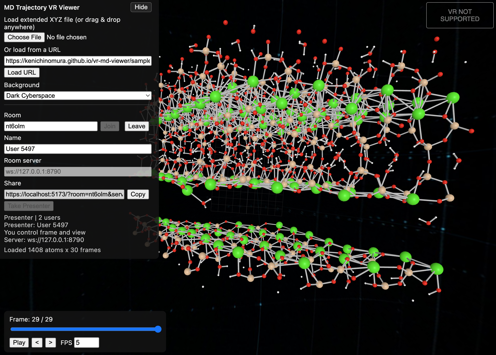
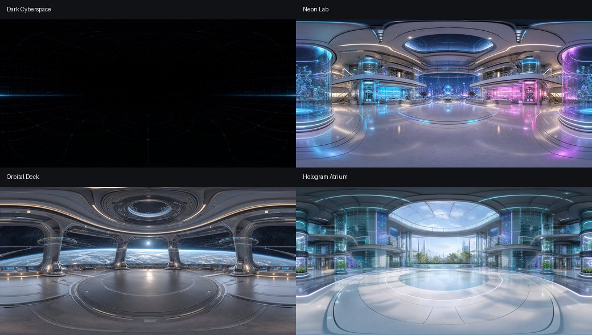

# VR MD Viewer Tutorial

This tutorial shows how to try the demo trajectory, load your own XYZ file, and start a shared multiuser room.

Open the viewer here:

[https://kenichinomura.github.io/vr-md-viewer/](https://kenichinomura.github.io/vr-md-viewer/)



## Try the Demo

1. Open the hosted viewer.
2. The URL field is prefilled with the bundled demo trajectory:

   ```text
   https://kenichinomura.github.io/vr-md-viewer/samples/tobe.xyz
   ```

3. Click **Load URL**.
4. Use the bottom-left playback panel's frame slider, **Play**, step buttons, and **FPS** field to inspect the trajectory.
5. Choose a **Background** if you want a different VR room environment.
6. Click **Hide** to collapse the controls and leave more space for the molecule.

The default background is **Dark Cyberspace**, which keeps atom colors easy to see.



## Load an XYZ File

The viewer supports standard XYZ and extended XYZ trajectory files:

```text
natoms
comment or Properties=...
Element x y z ...
Element x y z ...
```

There are three ways to load a file:

- Click **Choose File** and select a local `.xyz` file.
- Drag and drop a `.xyz` file onto the page.
- Paste a direct file URL into **Or load from a URL**, then click **Load URL**.

For single-user viewing, all three methods work. For multiuser rooms, use **Load URL** because local files are not sent to other users.

## Start a Multiuser Room

Multiuser rooms synchronize lightweight viewing state. Each user renders the molecule locally, while the room shares the trajectory URL, frame, play/pause state, FPS, background, presenter, molecule transform, and desktop camera view.

1. Open the hosted viewer.
2. Load a trajectory with **Load URL**.
3. In the **Room** field, keep the generated room code or type your own short code.
4. Type your display name in **Name**.
5. Keep the default deployed room server:

   ```text
   wss://vr-md-viewer-room.kenichi-nomura.workers.dev
   ```

6. Click **Join**.
7. Click **Copy** under **Share** and send the link to another user.
8. The other user opens the share link and clicks **Join**.

The first user in the room becomes the presenter. The presenter controls playback, FPS, background, molecule position, molecule rotation, molecule scale, and desktop camera view. Other users follow the presenter.

To transfer control, another user clicks **Take Presenter**.

## Use a Custom XYZ File in a Room

For everyone in a room to see the same trajectory, the file must be reachable by every browser.

Good options:

- A file hosted on GitHub Pages.
- A direct HTTPS file URL from a web server.
- A public file URL with browser-accessible CORS headers.

Avoid using **Choose File** for a room demo. Local file loading only affects your own browser, so other room members will wait for a trajectory URL.

## Use VR

VR requires a WebXR-compatible browser and a secure HTTPS page.

1. Open the hosted viewer in a WebXR browser, such as Quest Browser.
2. Load the demo trajectory or another URL-based XYZ trajectory.
3. Click **Enter VR** in the top-right corner.
4. Use VR controllers to grab, move, and scale the molecule.
5. Select atoms in VR to measure distances and angles.

If **Enter VR** does not appear, the current browser or device is not exposing an `immersive-vr` WebXR session to the page.

## Quick Troubleshooting

- **Room stays on Connecting:** check that the room server starts with `wss://` on the hosted HTTPS page.
- **Other users do not see my molecule:** load the trajectory with **Load URL**, not **Choose File**.
- **A follower cannot control the scene:** click **Take Presenter** first.
- **FPS does not change for followers:** only the presenter can change shared FPS.
- **VR button says not supported:** use a WebXR-compatible headset browser over HTTPS.
